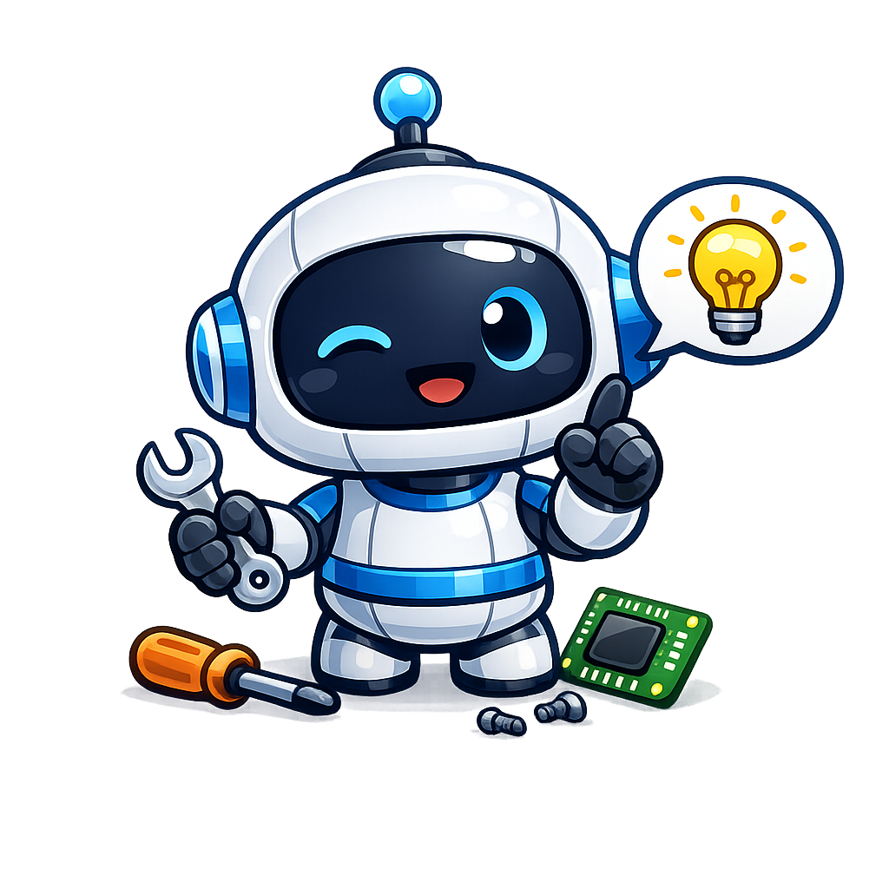

# :material-tools:{ .orange-icon } Bienvenue dans le Nexus de Lilevitchi

**Plongez au cœur de l'excellence du modding.** Que vous soyez ici pour stabiliser votre jeu, transformer son visuel ou vivre une aventure totalement nouvelle sur les terres désolées, vous êtes au bon endroit. 

Ici, pas de blabla inutile : uniquement des guides précis, testés et approuvés pour garantir une expérience de jeu ultime. Choisissez votre univers et commencez la transformation.

---

    <a href="fallout4/" class="game-card">
        

        
<h2>Fallout 4</h2>

    </a>
    <a href="fallout-london/" class="game-card">
        

        
<h2>Fallout London</h2>

    </a>
    <a href="fnv/" class="game-card">
        

        
<h2>New Vegas</h2>

    </a>
    <a href="ttw/" class="game-card">
        

        
<h2>TTW</h2>

    </a>
    <a href="cyberpunk/" class="game-card">
        

        
<h2>Cyberpunk 2077</h2>

    </a>

---

## :material-lightbulb-outline:{ .orange-icon } Le Conseil de Lile-Bot

    
    

        <strong id="lile-bot-title">Chargement...</strong> 
        Lile-Bot réfléchit à une astuce...
    

---

## :material-coffee:{ .orange-icon } Soutenir le Travail
Si mes guides vous font gagner du temps et du plaisir de jeu, n'hésitez pas à soutenir le projet. Chaque don permet d'améliorer la qualité des contenus et de maintenir les serveurs.

<a href="https://ko-fi.com/lilevitchi" target="_blank" class="kofi-button">
    :simple-kofi: Soutenir sur Ko-fi
</a>

---

## :material-link:{ .orange-icon } Liens Utiles

[:fontawesome-brands-youtube:{ .orange-icon } YouTube](https://www.youtube.com/@Lilevitchi){ target="_blank" } | [:fontawesome-brands-twitch:{ .orange-icon } Twitch](https://twitch.tv/lilevitchi){ target="_blank" } | [:fontawesome-brands-discord:{ .orange-icon } Discord](https://discord.gg/aFJxsPC){ target="_blank" }
